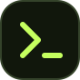

<div align="center">



# Practice Lab

**Learn Python. Solve Problems. Build Confidence.**

A focused local workspace for Python practice, reference solutions, and your next idea.

<p>
  <a href="#collection"></a>
  <a href="#collection"></a>
  <a href="#quick-start"></a>
  <a href="#local-data"></a>
</p>

[Overview](#overview) · [Quick start](#quick-start) · [Collection](#collection) · [Validation](#validation) · [Architecture](#architecture) · [Local data](#local-data)

</div>

---

## Overview

Practice Lab brings a collection of Python exercises into one workspace: browse a problem, write your solution, run checks, and track your progress. Structured docstrings in `problems/*.py` supply the prompts; those same files contain the reference implementations.

| Explore | Practice | Make it yours |
| --- | --- | --- |
| Search by title or concept; filter by difficulty, topic, and progress. | Work with separate solution, test, and standard-input editors. | Save drafts automatically and mark completed exercises. |
| Read prompts and reveal reference solutions when you need them. | Run Python in a browser worker with a 10-second timeout. | Create new exercises directly in the repository with **Add problem**. |

The interface adapts to desktop, tablet, and mobile layouts. Python runs through a locally served Pyodide runtime; after the one-time setup, normal practice works offline. The server listens only on `127.0.0.1`.

## Quick start

You need **Node.js** to run the workspace. Install Python separately if you want to run source modules or the Python validation suite. The optional browser audit requires Node 24+ and Chrome.

For a fresh checkout:

```powershell
git clone https://github.com/Satyajit-Senapati/PracticeLab.git
cd PracticeLab
node app/setup-runtime.mjs
node app/server.mjs serve
```

Open **[localhost:8765](http://127.0.0.1:8765)**. The serve command also opens the app in your browser.

For an existing checkout with the runtime installed, start directly:

```powershell
node app/server.mjs serve
```

The setup command downloads the pinned runtime and its license into `app/dist/vendor/`. These files are not tracked in Git. Extra third-party Python packages are not bundled.

### Your first session

1. Choose an exercise from the library.
2. Write a solution and add assertions in **Tests**, or supply **Standard input**.
3. Select **Run code** and inspect the console.
4. Review the reference solution and mark the exercise solved when you're ready.

Drafts save automatically. An infinite loop is stopped after 10 seconds; running again starts a fresh worker.

## Collection

The current library contains **207 exercises across 213 Python source files**, with a reference solution for every library exercise. It covers Python language features, data structures, algorithms, and practical programming tasks.

Recent additions include:

| Exercise | What you'll practise |
| --- | --- |
| [Balanced brackets](problems/balanced_brackets.py) | Stack-based parsing and nesting |
| [Merge sorted iterators](problems/merge_sorted_iterators.py) | Lazy streams and heap-based merging |
| [Flatten nested iterables](problems/flatten_nested_iterables.py) | Generators and explicit stacks |
| [Group records](problems/group_records.py) | Dictionaries and ordered grouping |
| [Unweighted shortest path](problems/shortest_path_unweighted.py) | BFS and path reconstruction |
| [Dijkstra shortest paths](problems/dijkstra_shortest_paths.py) | Weighted graphs and priority queues |

Six repeated tasks are consolidated in the library. Their original source files remain executable, and old problem links resolve to the canonical exercise. Saved progress and the latest draft migrate once; the original draft records remain in browser storage.

### Add an exercise

Select **Add problem** in the workspace. Expand **Starter code, tests, and reference solution** to provide scaffolding and checks, then select **Create problem**. The local server writes the Python file to `problems/` and any optional overrides to `practice_specs/`.

You can also create a Python file manually. Only `Problem Statement` and `Interview Difficulty` are required in its docstring:

```python
"""sum_values.py

Problem Statement:
Return the sum of the supplied integers.

Interview Difficulty: Easy
Concepts Tested: iteration, arithmetic
Example Inputs and Outputs:
    sum_values([1, 2, 3]) -> 6
"""


def sum_values(values):
    return sum(values)
```

For custom starter code or tests, add `practice_specs/sum_values.json`:

```json
{
  "category": "Python",
  "starter_code": "def sum_values(values):\n    raise NotImplementedError\n",
  "tests": "assert sum_values([1, 2, 3]) == 6\n"
}
```

Refresh the page after manually changing files. The app reads the current collection on each page load; regenerate the saved catalog before validation with `node app/server.mjs build`.

### Run a source module

From the repository root:

```powershell
python -m problems.n_queens
```

Use module mode so exercises named `enum.py` or `dataclasses.py` don't shadow Python's standard-library modules.

## Validation

Run the project checks from the repository root:

```powershell
node app/server.mjs build
node app/validate.mjs
node --test app/tests/*.test.mjs
python -B app/tests/corpus_check.py
```

| Check | Coverage |
| --- | --- |
| Catalog validation | Generated catalog freshness, unique ids and aliases, duplicate statements, metadata, and JavaScript syntax |
| JavaScript tests | Drafts, progress filters, alias migration, runner recovery, local file creation, and offline runtime startup |
| Python collection checks | Compilation and isolated execution of every source module, runnable documented examples, reference checks, and selected exhaustive small-input comparisons |
| Optional browser audit | Responsive layouts, dialogs, keyboard navigation, filtering, Python execution, standard input, error recovery, and saved-draft migration |

Run the browser audit with Node 24+ and Chrome installed:

```powershell
node app/tests/browser-audit.mjs
```

Set `CHROME_PATH` if Chrome is installed elsewhere. The audit starts a temporary local server and isolated browser profile, checks eight viewport sizes from 320 to 1920 pixels wide, and prints the location of its screenshots.

These checks catch regressions and validate the covered cases; they do not prove every algorithm correct for every possible input.

## Architecture

The local Node server reads Python docstrings and optional practice specs to build the catalog. The browser displays that catalog, saves drafts in browser storage, and sends code to an isolated Python worker. Creating a problem sends a request to the local server, which writes the source and optional spec files.

```text
PracticeLab/
├── problems/                Python prompts and reference solutions
├── practice_specs/          Optional titles, categories, starters, and tests
├── app/
│   ├── server.mjs           Local server and catalog builder
│   ├── setup-runtime.mjs    One-time runtime download
│   ├── validate.mjs         Catalog and application checks
│   ├── dist/                Browser application and generated catalog
│   │   └── vendor/          Local Python runtime (not tracked in Git)
│   └── tests/               JavaScript, Python, and browser checks
└── docs/assets/             README artwork
```

The server, app, and bundled runtime all run on your computer. There is no active hosting configuration. For runtime background, see [Pyodide's self-hosting documentation](https://pyodide.org/en/stable/usage/downloading-and-deploying.html).

## Local data

| Data | Where it lives | How to preserve it |
| --- | --- | --- |
| Prompts and reference solutions | `problems/` | Back up or commit the source files. |
| Optional titles, starters, and tests | `practice_specs/` | Keep these alongside the corresponding Python files. |
| Drafts and practice progress | Browser storage | Return with the same browser and `http://127.0.0.1:8765`; clearing browser data removes drafts. |
| Downloaded Python runtime | `app/dist/vendor/` | Copy it for immediate offline use, or rerun setup while online. |

A different hostname or port uses separate browser storage. Drafts from a former hosted version do not transfer automatically: copy any drafts you need and retain downloaded `.py` and `.json` files before removing that browser data.

Practice Lab is intentionally **local only**. Publishing is a separate decision, not part of setup or normal use.
